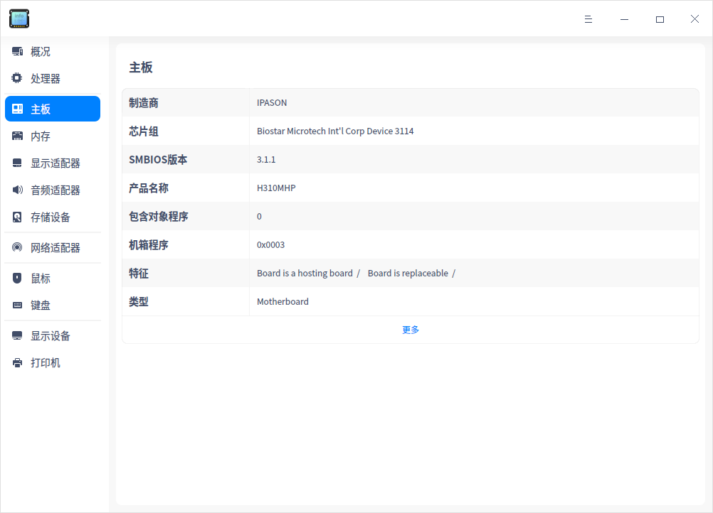
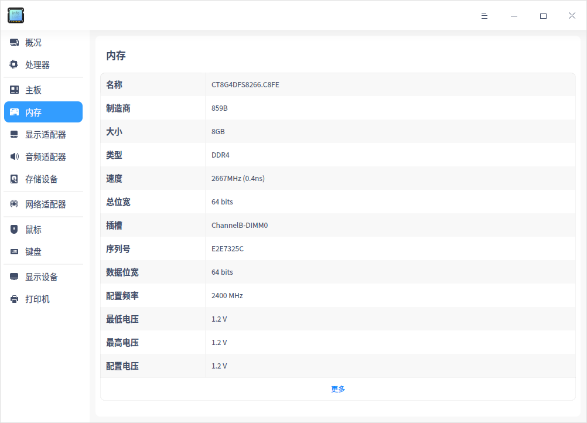
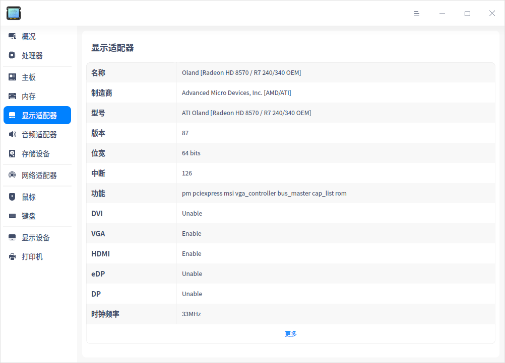
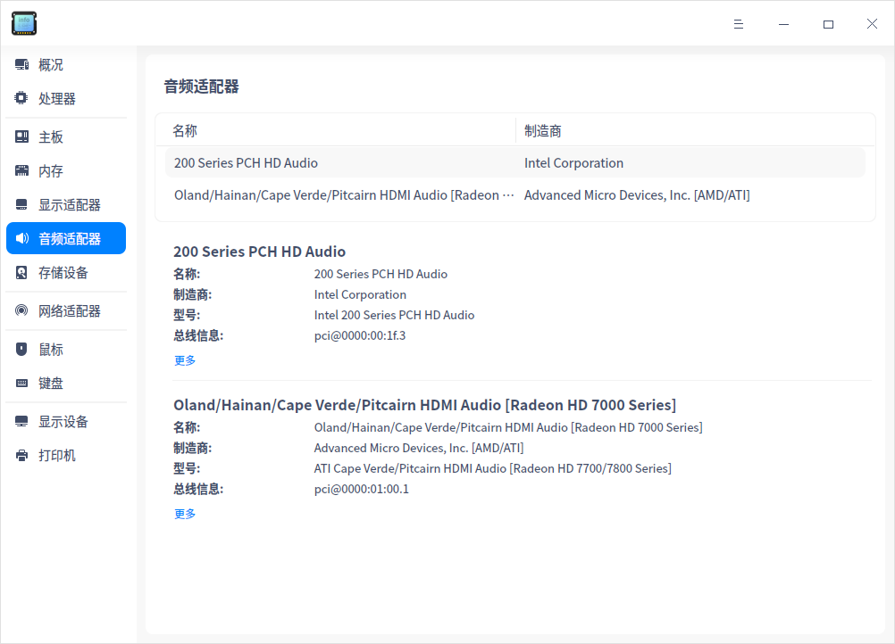
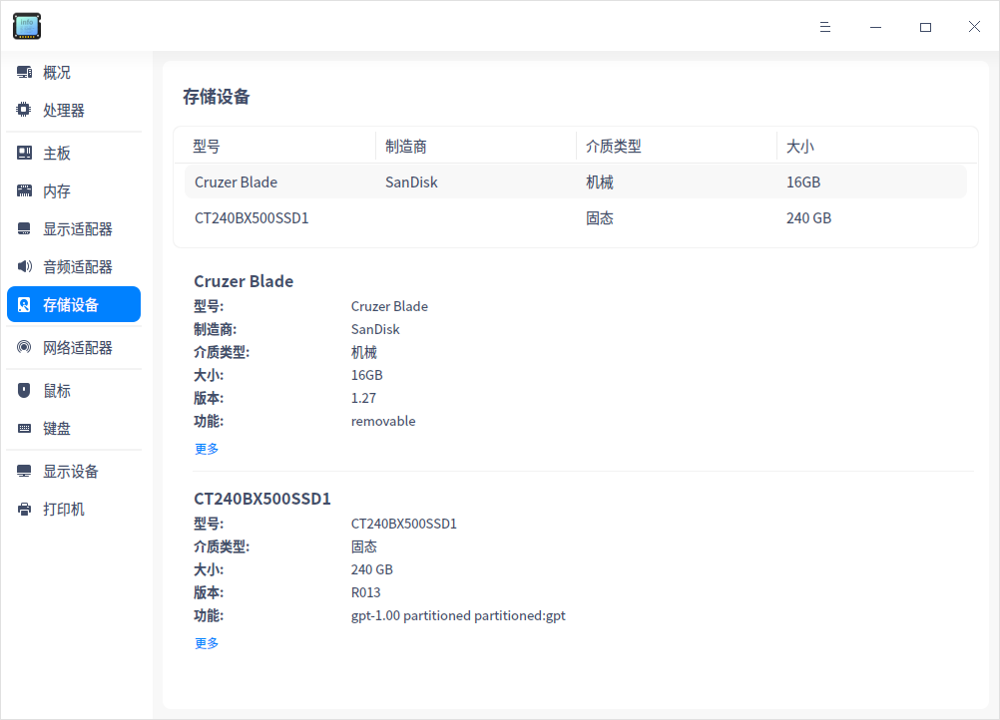
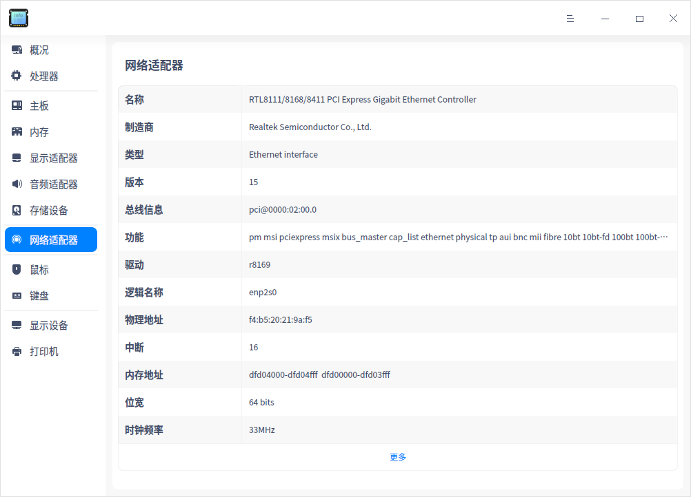
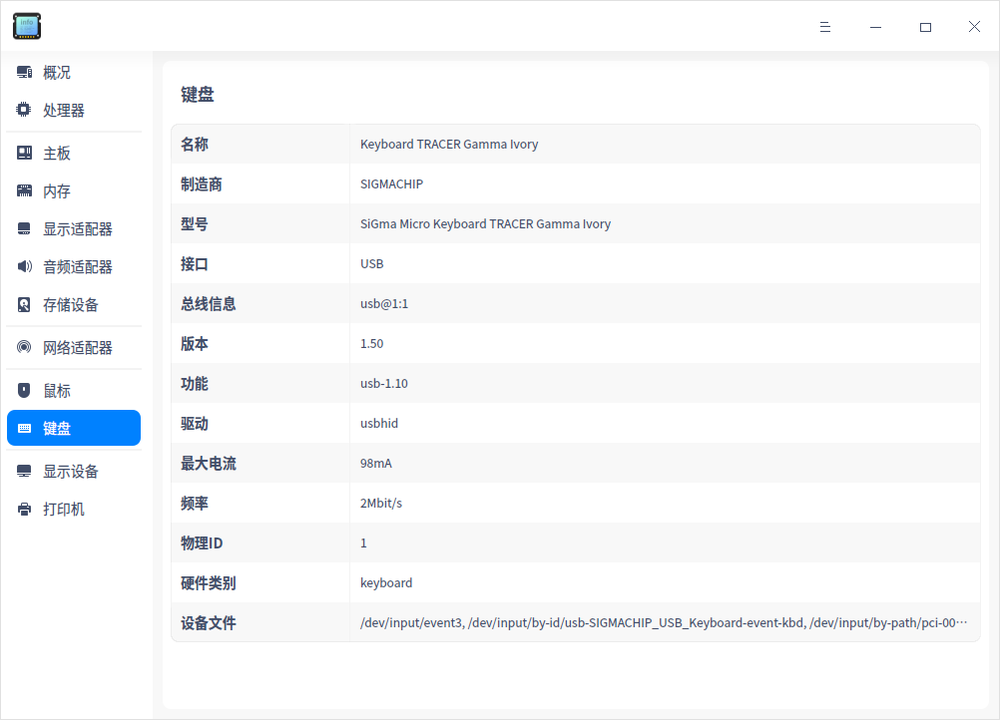
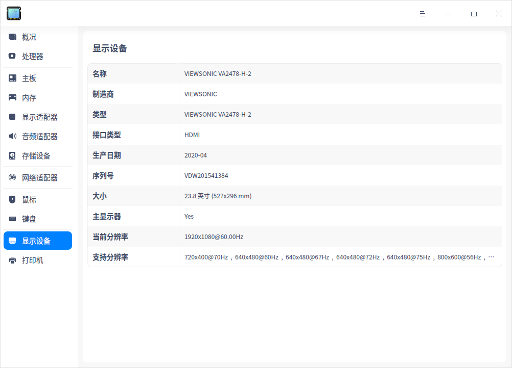
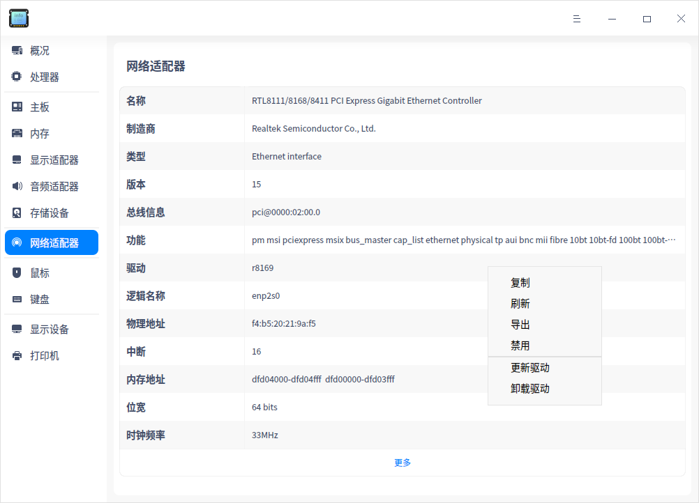
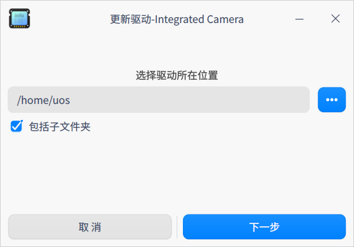

# 设备管理器|deepin-devicemanager|

## 概述

设备管理器是查看和管理硬件设备的工具，可针对运行在操作系统的硬件设备，进行参数状态的查看、数据信息的导出等，还可以禁用或启动部分硬件驱动。

## 使用入门

您可以通过以下方式运行或关闭设备管理器，或者创建快捷方式。

### 运行设备管理器

1. 单击任务栏上的启动器图标 ，进入启动器界面。

2. 上下滚动鼠标滚轮浏览或通过搜索，找到设备管理器图标  ，并单击运行。

3. 右键单击  ，您可以：

   - 单击 **发送到桌面**，在桌面创建快捷方式。

   - 单击 **发送到任务栏**，将应用程序固定到任务栏。

   - 单击 **开机自动启动**，将应用程序添加到开机启动项，在电脑开机时自动运行该应用程序。

### 关闭设备管理器

- 在设备管理器界面，单击   ，退出设备管理器。
- 右键单击任务栏上的  ，选择 **关闭所有** 来退出设备管理器。
- 在设备管理器界面单击  ，选择 **退出** 来退出设备管理器。

## 设备信息
设备管理器展示的信息与电脑硬件相关，如果您的电脑接入鼠标、键盘等设备，则会显示对应的设备信息。如果检测到多个同类型设备，则以列表形式显示设备信息。以下内容仅作参考，请以实际情况为准。

### 概况

1. 在设备管理器界面，单击 **概况**。
2. 查看操作系统内核信息及各硬件设备列表。

### 处理器

1. 在设备管理器界面，单击 **处理器**。
2. 查看处理器的名称、制造商、处理器及架构等信息。

### 主板

1. 在设备管理器界面，单击 **主板**。
2. 查看主板的制造商、版本、芯片组、SMBIOS版本等信息。

### 内存

1. 在设备管理器界面，单击 **内存**。
2. 查看内存的名称、制造商、大小、类型及速度等信息。

### 显示适配器

1. 在设备管理器界面，单击 **显示适配器**。
2. 查看显示适配器的名称、制造商、型号等信息。

### 音频适配器

1. 在设备管理器界面，单击 **音频适配器**。
2. 查看音频适配器的名称、制造商及型号等信息。

### 存储设备

1. 在设备管理器界面，单击 **存储设备**。
2. 查看存储设备的型号、制造商、介质类型等信息。

### 网络适配器

1. 在设备管理器界面，单击 **网络适配器**。
2. 查看网络适配器的名称、制造商、类型及驱动等信息。

### 键盘

1. 在设备管理器界面，单击 **键盘**。
2. 查看键盘的名称、型号、制造商、接口等信息。

### 显示设备

1. 在设备管理器界面，单击 **显示设备**。
2. 查看显示设备的名称、制造商、类型、接口类型等信息。

 

## 操作介绍

在设备详细信息区域，单击右键，可以进行相关操作。

### 复制

复制当前页面的所有信息。对于可选中的信息，也可以局部复制。

### 刷新

将重新加载操作系统当前所有设备的信息，快捷键为 **F5**。

### 导出

将设备信息导出到指定的文件夹，支持导出 txt/docx/xls/html 格式。

### 禁用/启用

部分硬件驱动支持禁用和启用功能，硬件驱动默认是启用状态，根据右键菜单选项判断是否支持禁用功能。

### 更新驱动

部分硬件支持更新/卸载驱动功能，可以根据右键菜单选项进行判断。当前仅支持本地驱动文件的安装更新。

1. 在右键菜单中选择 **更新驱动**，弹出窗口。

2. 选择驱动所在的文件夹，单击 **下一步** 按钮。默认勾选 “包括子文件夹”，表示检测文件夹以及子文件夹中包含的驱动文件。

   

3. 系统会检测该文件位置包含的所有可安装的deb和ko格式驱动文件，选择对应的驱动文件后，单击 **更新** 按钮。

   

4. 弹出认证窗口，输入系统登录密码完成认证后进行更新。

5. 如果更新失败了，系统自动将该设备的驱动回滚至之前的驱动版本，不影响使用。建议根据系统提示查找失败原因，重新更新。

### 卸载驱动

对于不想使用的设备，可以卸载驱动。

1. 在右键菜单中选择 **卸载驱动**，二次确认后，单击 **卸载** 按钮。

   - 卸载成功：设备状态变为不可用。

   - 卸载失败：原驱动正常使用，建议根据系统提示查找失败原因，重新卸载。

2. 如果想重新使用该设备，在设备详细信息页面单击右键，并选择 **更新驱动** 安装驱动。

## 主菜单

在主菜单中，您可以切换窗口主题，查看帮助手册等。

### 主题

窗口主题包含浅色主题、深色主题和系统主题。

1. 在设备管理器界面，单击 。
2. 单击 **主题**，选择一个主题颜色。

### 帮助

1. 在设备管理器界面，单击 。
2. 单击 **帮助**，查看帮助手册，进一步了解和使用设备管理器。

### 关于

1. 在设备管理器界面，单击 。
2. 单击 **关于**，查看设备管理器的版本和介绍。

### 退出

1. 在设备管理器界面，单击 。
2. 单击 **退出**。

